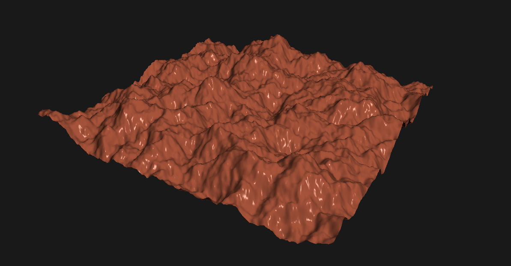
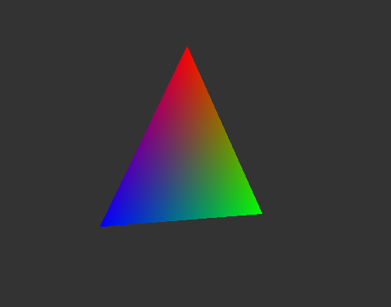
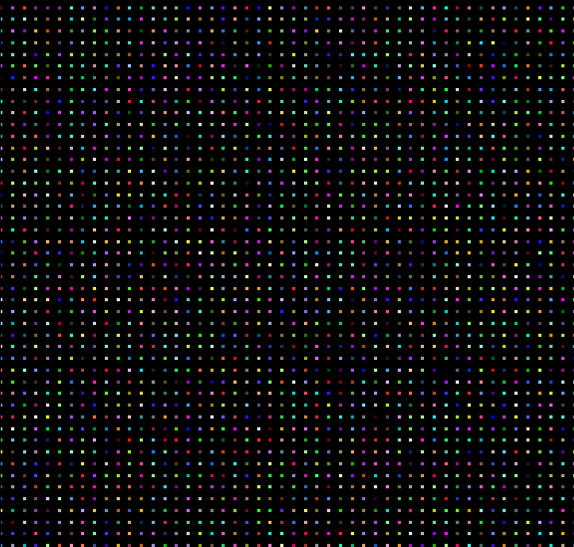
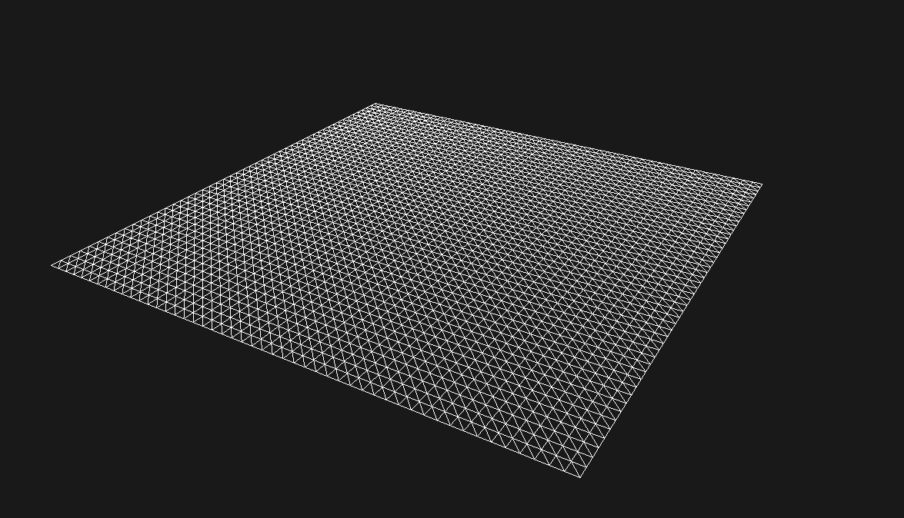
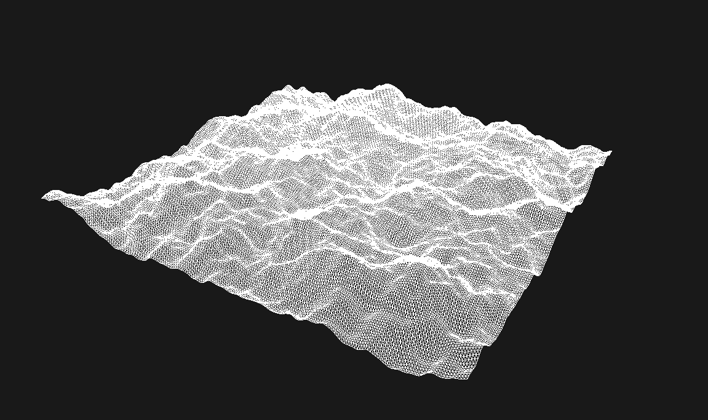

# Perlin Terrain

A small project where I build up to a lit, procedurally generated terrain using ModernGL, one step at a time. Each script is a working program that adds one new idea on top of the previous one, so you can read them in order and see how things come together.

Everything runs on Python with `moderngl` and `moderngl-window`, and the environment is managed with [pixi](https://pixi.sh).



## Setup

```
pixi install
```

Then run any of the steps with:

```
pixi run python <script>.py
```

## The steps

### 1. A rotating triangle

`rotating_triangle.py`

The "hello world" of graphics. A single triangle with a color on each corner, spinning around the Y axis. The perspective, translation and rotation matrices are written by hand in NumPy, which is a good way to see what a model-view-projection matrix actually is before handing that job to a library.



### 2. The same triangle, with GLM

`rotating_triangle_glm.py`

Exactly the same scene, but the matrices now come from `glm` (`perspective`, `lookAt`, `rotate`). Less code, same result, and this is what the rest of the project uses.

### 3. A quick detour: running a shader without drawing anything

`va_id_product.py`

Not really on the path to terrain, but useful for getting a feel for how shaders execute. It runs a vertex shader with no inputs, uses transform feedback to write `gl_VertexID` and its square into a buffer, and reads the result back on the CPU. No window involved.

### 4. A grid of points

`point_grid.py`

A 50x50 grid of randomly colored points laid out with `np.meshgrid`. This is the first time we generate geometry in code rather than typing out vertices, and that grid is the foundation for the terrain.



### 5. Turning the grid into a mesh

`flat_mesh.py`

The grid gets laid flat on the XZ plane and each square cell is split into two triangles using an index buffer. Rendered in wireframe and viewed from an angle, it looks like a flat sheet of graph paper floating in space.



### 6. Perlin noise terrain

`perlin_terrain.py`

Now the fun part. Each vertex gets a height from Perlin noise: random gradient vectors on a lattice, dot products with the corner offsets, and a smooth fade curve to blend them. A few octaves of that are stacked together (fractal Brownian motion) so you get large hills with smaller bumps on top. Still wireframe, but it already looks like a landscape.



### 7. Lighting it with Blinn-Phong

`perlin_terrain_wlighting.py`

The final version. Per-vertex normals are computed by averaging the normals of the surrounding triangles, and the fragment shader (`shaders/terrain.frag`) does ambient, diffuse and Blinn-Phong specular lighting. The terrain is rendered as a solid surface with a single base color, and the shading is what gives it shape.


All the knobs live in `configs/perlin_terrain.yaml` (seed, grid size, noise octaves, terrain color, light position, camera, and so on). It uses Hydra, so you can also change things from the command line:

```
pixi run python perlin_terrain_wlighting.py terrain.amplitude=0.6 terrain.num_octaves=8
pixi run python perlin_terrain_wlighting.py wireframe=true seed=7
```

## Layout

```
rotating_triangle.py          step 1
rotating_triangle_glm.py      step 2
va_id_product.py              step 3 (side quest)
point_grid.py                 step 4
flat_mesh.py                  step 5
perlin_terrain.py             step 6
perlin_terrain_wlighting.py   step 7
shaders/                      GLSL shaders used by the steps above
configs/                      Hydra config for the final step
assets/                       screenshots used in this README
```
